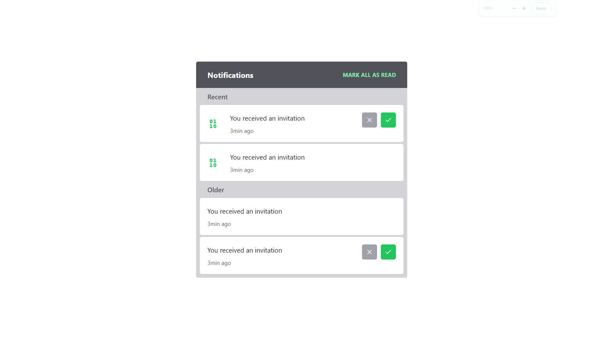
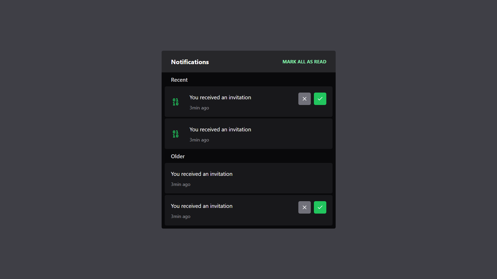

## Descrição

Um widget de notificação construído com React, TypeScript e TailwindCSS. É utilizado o padrão de composição para construção de componentes.

## Screenshots da Aplicação

<p align="center">
  
</p>
<p align="center">
  
</p>

### Requisitos

- Git
- Node.js
- Visual Studio Code

### Instalação

1. Clone o repositório:

   ```bash
   git clone https://github.com/kauatwn/composition-pattern-react.git
   ```

2. Instale as dependências:

   ```bash
   npm install
   ```

3. Execute o comando:

   ```bash
   npm run dev
   ```
